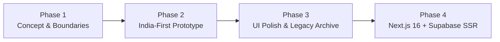

# 🪷 Bandhan (बंधन)

**Bandhan** is an India-first platform bridging meaningful long-term relationship discovery (**Saccha Saathi**) with respectful, platonic event companionship (**Event Saathi**). Designed thoughtfully for modern Indian social contexts—such as attending high-pressure family weddings, corporate galas, or festive reunions without social stigma.

---

## 🗺️ Project Evolution: Phases 1 to 4



### Phase 1: Conceptual Foundation & Core Value Proposition
- **Dual-Track Companionship Model**:
  - **Saccha Saathi (सच्चा साथी)**: Value-driven, authentic matrimonial and long-term soulmate discovery.
  - **Event Saathi (इवेंट साथी)**: Verified, strictly platonic companionship tailored for family weddings, cultural ceremonies, and corporate functions.
- **Platonic Safety & Code of Conduct**: Defined strict non-negotiable boundaries, zero-tolerance harassment rules, public venue constraints, and chaperone guidelines.

### Phase 2: India-First Features, Cultural Filters & Narrative Tools
- **Rich Companion Directory**: Profiles enriched with Indian socio-cultural attributes:
  - *Languages*: Hindi, English, Punjabi, Bengali, Marathi, Tamil, etc.
  - *Dietary Preferences*: Pure Vegetarian, Jain, Non-Vegetarian.
  - *Horoscope & Values*: Kundali matching compatibility and personal philosophy.
- **Witty Family Defense Toolkit**: Integrated interactive features such as:
  - *Auntie-Repellent Dialogues*: Pre-scripted, culturally disarming responses to nosy relatives asking *"Shaadi kab kar rahe ho?"*
  - *Backstory Generator*: Co-created believable backstories for how the pair met (e.g. mutual friends, co-working space, university seminar).

### Phase 3: Interactive Polish, Accessibility & Static Prototype Archival
- **Centralized Event Layer**: Clean separation of UI and business logic using dynamic `data-action` attributes without inline handlers.
- **Interactive Modals & Pass System**: Instant booking workflows, simulated UPI payment screens (with prominent demo disclaimers), and printable event companion passes.
- **Accessibility & Responsive Polish**: Added `prefers-reduced-motion` compliance, mobile-responsive breakpoints, and glassmorphic micro-animations.
- **Archival**: The complete V3 interactive static prototype is preserved in [`public/legacy-v3/`](file:///c:/Users/AVROJIT/OneDrive/Desktop/personal%20project/public/legacy-v3) for visual, interactive, and copy reference.

### Phase 4: Full-Stack Production Architecture (Bandhan V4)
- **Modern Web Stack**: Migrated from static multi-file scripts to **Next.js 16 (App Router)**, **React 19**, and **TypeScript**.
- **Supabase SSR Backend**:
  - PostgreSQL schema with custom enums (`app_role`: `customer`, `provider`, `admin`; `booking_status`: `requested`, `confirmed`, `declined`, `cancelled`, `completed`).
  - Relational tables: `profiles`, `services`, `availability_slots`, `bookings`, and `booking_events`.
  - Strict Row Level Security (RLS) and least-privilege role permissions.
- **Server-Enforced Role-Based Access Control (RBAC)**:
  - Server-side guards verify application identity directly from the `profiles` table; client-editable `user_metadata` is never trusted for authorization.
  - Route separation: `/discover` (public), `/onboarding` (profile creation), `/dashboard` (customers), `/provider` (providers), and `/admin` (supervisors).
- **Session Lifecyle & Proxy**: Next 16 session refresher ([`proxy.ts`](file:///c:/Users/AVROJIT/OneDrive/Desktop/personal%20project/proxy.ts)) coordinating SSR cookies with Supabase tokens.
- **Automated Domain Tests**: Built-in test runner validating booking scheduling logic (past time rejection, end-after-start constraints) and role boundary enforcement.

---

## 📦 What is Included in V4

- **App Router Pages**:
  - `/`: Landing page introducing the dual proposition and curated community profiles.
  - `/discover`: Public provider discovery catalog.
  - `/auth`: Sign-in and account registration powered by Supabase Server Actions.
  - `/onboarding`: New user role assignment (`customer` or `provider`) and profile creation.
  - `/dashboard`: Customer management dashboard displaying active and past booking requests.
  - `/provider`: Provider workspace for incoming booking management and service setup.
  - `/admin`: Administrative review console guarded by strict admin role checks.
- **Database Migrations**: Located at [`supabase/migrations/20260912000000_bandhan_v4.sql`](file:///c:/Users/AVROJIT/OneDrive/Desktop/personal%20project/supabase/migrations/20260912000000_bandhan_v4.sql).
- **Domain Test Suite**: Node.js test runner at [`src/__tests__/run.mjs`](file:///c:/Users/AVROJIT/OneDrive/Desktop/personal%20project/src/__tests__/run.mjs).

---

## 🛠️ Local Setup Guide

1. **Prerequisites**: Ensure **Node 20+** is installed (`node -v`).
2. **Install Dependencies**:
   ```bash
   npm install
   ```
3. **Environment Configuration**:
   Copy `.env.example` to `.env.local`:
   ```bash
   cp .env.example .env.local
   ```
   Add your project credentials (never expose service-role keys in public variables):
   ```env
   NEXT_PUBLIC_SUPABASE_URL=https://your-project.supabase.co
   NEXT_PUBLIC_SUPABASE_PUBLISHABLE_KEY=your-publishable-key
   ```
4. **Database Migration**:
   Link your remote Supabase project and push the schema:
   ```bash
   npx supabase link --project-ref <your-project-ref>
   npx supabase db push
   ```
5. **Supabase Auth Setup**:
   - In your Supabase Dashboard, go to **Authentication -> URL Configuration**.
   - Add your local callback URL: `http://localhost:3000/auth`.
6. **Run Verification & Development Server**:
   ```bash
   npm test             # Run domain tests
   npm run typecheck    # Validate TypeScript types
   npm run build        # Build production Next.js bundle
   npm run dev          # Start local dev server at http://localhost:3000
   ```

---

## 🚀 Production Checklist & Hosting

See the full [Deployment Guide (DEPLOYMENT.md)](file:///c:/Users/AVROJIT/OneDrive/Desktop/personal%20project/DEPLOYMENT.md) for step-by-step instructions on deploying to Vercel, Netlify, or Docker/Node VPS hosts.

Before deploying Bandhan V4 to production:
- [ ] **Audited State Machine**: Implement server-side RPCs for booking transitions (`requested` -> `confirmed` / `declined` / `completed`).
- [ ] **Real KYC & Provider Verification**: Integrate official identity verification (Aadhaar/DigiLocker/government ID check).
- [ ] **Payment Integration**: Connect a secure payment gateway (e.g., Razorpay, Cashfree, or Stripe) with webhook signature verification.
- [ ] **Transactional Notifications**: Add SMS/WhatsApp/email alerts for booking confirmations and schedule updates.
- [ ] **Rate Limiting & Moderation**: Add edge rate limiting on auth and booking endpoints, plus admin review queues.
- [ ] **Legal & Privacy Compliance**: Finalize terms of service, privacy policy, and platonic code of conduct agreements.

